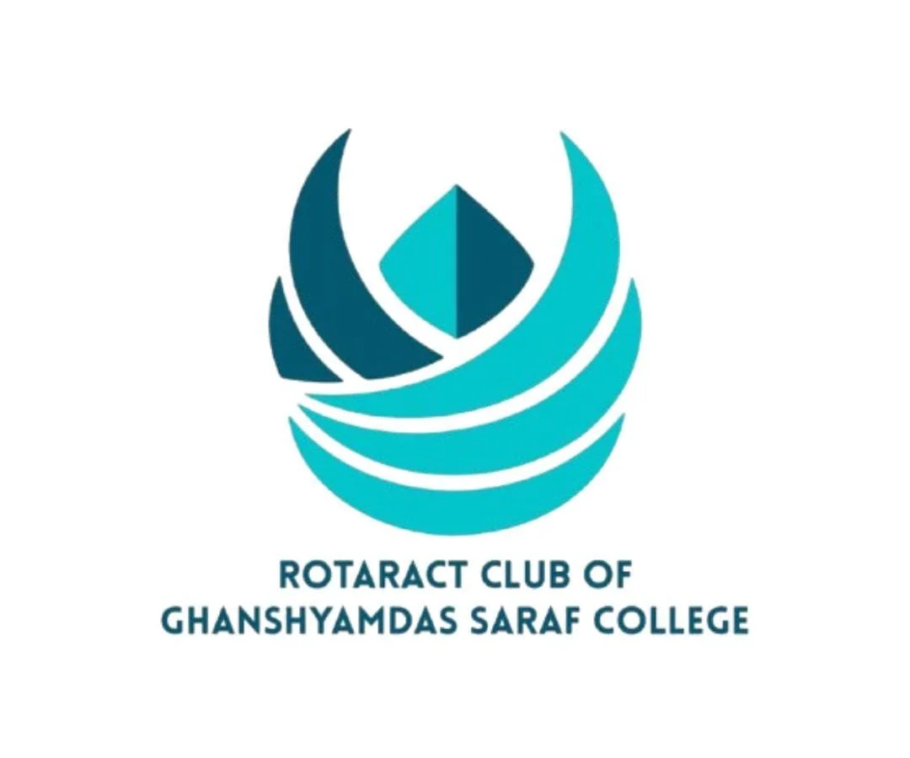
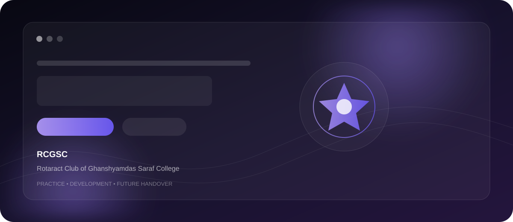

# RCGSC — Rotaract Club of Ghanshyamdas Saraf College

> **Practice / Development Website**
>
> A polished React-based practice implementation for the **Rotaract Club of Ghanshyamdas Saraf College (RCGSC)**. The repository is currently positioned as a development preview and is intended for review and eventual handover to the original club members and authorized website administrators.
>
> **The live site should not be treated as the final official RCGSC website until the authorized team reviews and approves its content, branding, contacts, imagery, and policies.**

<p align="center">
  
</p>

<p align="center">
  <strong>REIGN · Unleash the Grace</strong><br>
  <sub>Rotaract District 3141 · 2026–27 Practice Build</sub>
</p>

<p align="center">
  <a href="https://chillingbing648-sketch.github.io/RCGSC/"><strong>✦ Open Live Practice Preview</strong></a>
  &nbsp; · &nbsp;
  <a href="https://github.com/chillingbing648-sketch/RCGSC"><strong>⌘ View Source</strong></a>
</p>

<p align="center">
  
  
  
  
  
</p>

<p align="center">
  
  
  
  
  
</p>

---

<p align="center">
  
</p>

<p align="center">
  <sub>Hero → About → Current Year → Avenues → Journey → Achievement → Events → Gallery → Join</sub>
</p>

---

## ✦ What This Project Is

RCGSC is a **motion-led club website implementation** built around a single-page narrative.

The current application combines:

- a branded hero experience
- club introduction
- current-year / leadership content
- four service avenues
- a club journey and milestone timeline
- achievement/citation presentation
- events surface
- image gallery
- join/contact surface
- persistent visual background and motion

The implementation is intentionally presented as a **practice/development build**, so the repository separates the quality of the digital experience from the approval of final official content.

---

## 🧭 Experience Architecture

The page is composed in this order:

```text
Galaxy Background
      │
      ▼
Navigation
      │
      ▼
Hero
      ↓
About
      ↓
Current Year
      ↓
Service Avenues
      ↓
Club Journey
      ↓
Achievement
      ↓
Events
      ↓
Gallery
      ↓
Join
      ↓
Footer
```

The main composition lives in `src/App.jsx`; each major surface is implemented as a focused React component rather than one large page component.

---

## 🎯 Current Product Surface

| Surface | Role |
|---|---|
| **Hero** | Establishes the club identity and current visual direction |
| **About** | Introduces the club and its service focus |
| **Current Year** | Presents the 2026–27 term context and leadership information |
| **Avenues** | Explains Community, Club, Professional Development and International Service |
| **Journey** | Shows selected club milestones and term history |
| **Achievement** | Highlights the current Daanveer citation |
| **Events** | Reserved for event content as it is populated |
| **Gallery** | Presents the current group imagery as the visual memory layer |
| **Join** | Provides the intended membership/contact entry surface |
| **Footer** | Closes the experience and site navigation |

---

## 🌌 Visual & Motion System

The visual language is built around a **dark, atmospheric, editorial club identity** rather than a conventional campus-information layout.

### Visual layers

- Galaxy-style animated background
- large-format hero composition
- responsive content sections
- image-led milestone and achievement surfaces
- layered typography and spacing
- mobile-aware presentation

### Motion stack

| Tool | Current role |
|---|---|
| **Framer Motion** | Component/interface motion |
| **GSAP** | Timeline and advanced animation work |
| **Lenis** | Smooth scrolling |
| **Custom scroll layer** | Scroll orchestration and refresh behavior |
| **GalaxyBackground** | Ambient background motion |

The application initializes its scrolling system from `src/lib/scroll` and refreshes scroll triggers after the page and fonts are ready.

---

## 🧠 Content Architecture

Content is intentionally centralized in:

```text
src/content.js
```

The file currently acts as the single source of structured club copy and asset references.

```text
content
├── club
├── district
├── year
├── president
├── theme
├── location
├── about
├── avenues[]
├── journey[]
├── daanveer
├── events[]
└── contact

gallery[]
```

Static images are resolved through the `asset()` helper using Vite's `import.meta.env.BASE_URL`, which keeps asset references compatible with the GitHub Pages subpath.

---

## 🖼️ Current Asset Layer

The repository currently includes dedicated club imagery for:

```text
public/images/
├── rcgsc-logo.webp
├── group-photo.jpeg
├── group-photo.webp
├── presidency-2025-26.webp
├── reign-crest.webp
└── daanveer-citation.webp
```

The gallery currently uses the JPEG group image in multiple crops/positions to create a composed visual grid.

---

## 🧩 Component Map

```text
src/
├── components/
│   ├── About.jsx
│   ├── Achievement.jsx
│   ├── Avenues.jsx
│   ├── CurrentYear.jsx
│   ├── Events.jsx
│   ├── Footer.jsx
│   ├── GalaxyBackground.jsx
│   ├── Gallery.jsx
│   ├── Hero.jsx
│   ├── Join.jsx
│   ├── Journey.jsx
│   ├── Lines.jsx
│   └── Navigation.jsx
│
├── lib/
│   └── scroll.js
│
├── App.jsx
├── content.js
└── main.jsx
```

This keeps the page composition readable while allowing each section to evolve independently.

---

## ⚙️ Technology Stack

| Area | Technology |
|---|---|
| UI | React 18 |
| Build | Vite 5 |
| Motion | Framer Motion + GSAP |
| Smooth scroll | Lenis |
| Language | JavaScript / ESM |
| Styling | CSS3 |
| Runtime | Browser APIs |
| Deployment | GitHub Actions + GitHub Pages |

---

## 🚀 Run Locally

### Requirements

- Node.js 20+
- npm

### Install

```bash
npm ci
```

### Start development

```bash
npm run dev
```

### Build production

```bash
npm run build
```

### Preview production

```bash
npm run preview
```

Vite will print the local development URL in the terminal.

---

## ☁️ Deployment

The repository is configured for **GitHub Pages through GitHub Actions**.

```text
git push origin main
        │
        ▼
GitHub Actions
        │
        ▼
npm ci
        │
        ▼
npm run build
        │
        ▼
dist/
        │
        ▼
GitHub Pages artifact
        │
        ▼
Live practice preview
```

The Vite configuration uses:

```js
base: '/RCGSC/'
```

so generated assets resolve correctly under the repository subpath.

---

## 🔎 Current Status

| Area | Current state |
|---|---|
| React application | Active |
| Responsive UI | Active |
| Motion system | Active |
| GitHub Pages deployment | Active |
| Practice preview | Active |
| Final official ownership | Pending handover |
| Final club copy | Requires authorized review |
| Events data | Currently empty |
| Contact/social fields | Currently not populated |

---

## ⚠️ Content & Handover Notes

The source file `src/content.js` explicitly marks some content as requiring replacement with verified material from the original club source.

Before this becomes an official club website, the authorized RCGSC team should review:

- club and leadership details
- dates and milestones
- event information
- contact details
- social links
- photographs and usage rights
- branding and campaign language
- final notices/policies

Until that review is complete, this README and the live site should be understood as describing a **practice implementation**, not an official statement from the club.

---

## 🗺️ Practical Development Roadmap

### Current foundation

- [x] React/Vite single-page structure
- [x] Responsive visual system
- [x] Motion and smooth-scroll layer
- [x] Structured club content model
- [x] Gallery and achievement surfaces
- [x] GitHub Pages deployment

### Next refinement areas

- [ ] Populate and verify events
- [ ] Add verified contact/social destinations
- [ ] Finalize approved club copy
- [ ] Review all imagery and permissions
- [ ] Complete official ownership/handover
- [ ] Continue accessibility and performance refinement

---

## 🤝 Ownership & Handover

This repository is currently intended to support **practice, demonstration, review and eventual handover**.

The future official website should be maintained by the original RCGSC members and authorized website administrators after content and ownership review.

The implementation can therefore be treated as:

```text
Practice build
    ↓
Content review
    ↓
Club approval
    ↓
Authorized handover
    ↓
Official maintenance
```

---

## RCGSC

**Rotaract Club of Ghanshyamdas Saraf College**

Practice website · Development preview · Intended for future official handover